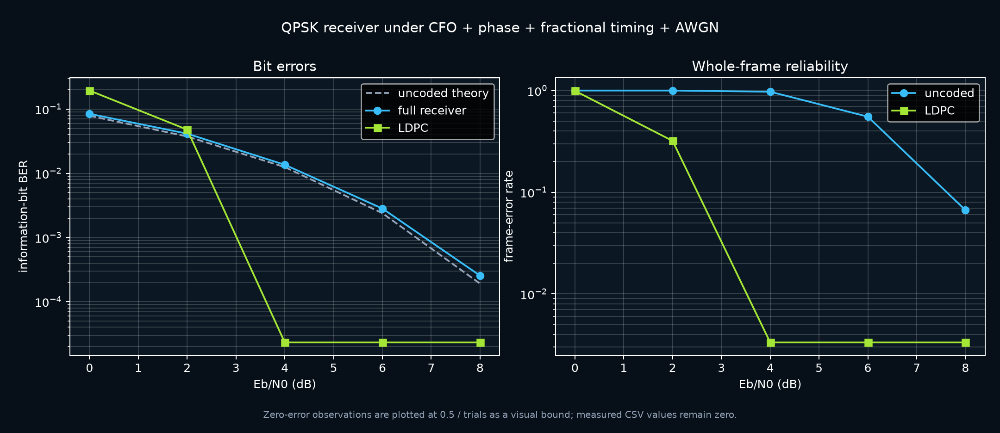

# sdr-receiver

A complete QPSK burst receiver, from bits to waveform and back: pulse shaping,
carrier and timing acquisition, soft decisions, and a rate-1/2 LDPC decoder.
The point is not a clean constellation generated with perfect timing. The
receiver has to recover a burst with carrier offset, phase error, fractional
sample timing, arbitrary gain, and AWGN all active at once.



## Measured result

150 frames per point, fixed impairments of **1.3% carrier offset**, **0.72 rad
phase error**, **0.31-sample timing offset**, and **0.45 gain**:

| Eb/N0 | uncoded theory | full receiver BER | LDPC BER | LDPC FER |
|---:|---:|---:|---:|---:|
| 0 dB | 7.865% | 8.440% | 19.477% | 99.33% |
| 2 dB | 3.751% | 4.146% | 4.792% | 32.00% |
| 4 dB | 1.250% | 1.359% | **0 / 21,600 bits** | **0 / 150 frames** |
| 6 dB | 0.2388% | 0.2824% | **0 / 21,600 bits** | **0 / 150 frames** |
| 8 dB | 0.0191% | 0.0255% | **0 / 21,600 bits** | **0 / 150 frames** |

Zero observed errors is not infinite evidence. The plot places a zero-error
point at `0.5 / trials` only so it can appear on a log axis; the CSV preserves
the measured zero and includes the plotting bound in a separate column.

The low-SNR result is also part of the result. At 0 dB the short code is below
its decoding threshold and is worse than uncoded QPSK. At 2 dB it is in the
waterfall: 68% of frames converge, but failed frames dominate BER. By 4 dB all
150 frames converge in an average of 3.1 iterations.

## Receiver

```mermaid
flowchart LR
    bits[Information bits] --> enc[Regular LDPC encoder]
    enc --> map[Gray QPSK]
    map --> tx[RRC pulse shaping]
    tx --> chan[CFO + phase + timing + gain + AWGN]
    chan --> agc[AGC]
    agc --> mf[Matched RRC]
    mf --> cfo[Normalized preamble and CFO search]
    cfo --> sync[Sub-sample timing and frame lock]
    sync --> phase[Residual carrier ML estimate]
    phase --> costas[Decision-directed Costas loop]
    costas --> llr[Exact soft LLRs]
    llr --> dec[Normalized min-sum LDPC]
    dec --> out[Recovered information]
```



The acquisition path is deliberately two-stage:

1. **Wide pull-in:** a normalized preamble correlation searches carrier
   frequency, sample phase, and frame lag without assuming the frame start.
2. **Precision estimate:** a local maximum-likelihood tone search on the known
   preamble estimates the residual frequency without phase unwrapping. A
   complex least-squares fit removes phase and gain and estimates noise power
   for the soft demapper.

The 96-symbol preamble pays real overhead, but it buys reliable acquisition at
the short 144-information-bit frame length used by this experiment.

## LDPC code

`SparseLDPC` builds a deterministic `(288, 144)` regular Tanner graph:

- variable degree 3;
- check degree 6;
- no length-4 cycles;
- full row rank over GF(2);
- normalized min-sum decoding with syndrome-based early stopping.

The encoder is derived from `H`, not a second hand-written implementation.
GF(2) row reduction identifies free information columns and pivot parity
columns, and every encoded word is checked against the original sparse matrix.

A non-converged iterative decoder is not allowed to make the answer silently
worse. If the syndrome is still nonzero at the iteration limit, the result is
marked `used_channel_fallback=True` and the receiver returns the channel hard
decisions. FER still counts that frame as failed.

## Four defects the tests caught

**Oversampled fourth-power CFO was biased.** Raising QPSK to the fourth power
removes data only at symbol decisions. Between RRC samples the waveform is a
mixture of adjacent symbols, so the estimator confidently returned the wrong
frequency. The receiver now acquires on matched, symbol-spaced hypotheses.

**Gain accidentally changed Eb/N0.** Applying channel gain to the signal but
not the configured AWGN made gain a hidden second SNR control. `ebn0_db` now
defines received SNR, so gain scales signal and noise together before AGC.

**Phase unwrapping poisoned short bursts.** One noisy `2π` unwrap error tilted
the fitted phase line and rotated an otherwise correct payload. Residual CFO is
now a bounded ML tone search—no unwrap state exists to get wrong.

**A failed decoder could add errors.** Min-sum messages can oscillate after a
detected parity failure. Returning the last oscillating vector made BER worse
than the channel. Non-convergence now produces an explicit channel-decision
fallback and remains visible in the benchmark.

All four have regression coverage.

## Reproduce it

```bash
python3 -m venv .venv
source .venv/bin/activate
pip install -r requirements-dev.txt
pip install -e .

pytest                                      # 20 tests
python bench/ber_sweep.py --frames 150      # CSV + plot
```

The raw data is committed at [`results/ber.csv`](results/ber.csv). The random
seed, channel parameters, bit/error counts, frame counts, decoder convergence,
iteration counts, and acquisition scores are all included.

## Layout

```text
sdr/
  modem.py       Gray QPSK, hard decisions, exact AWGN LLRs, theory
  filters.py     RRC design, pulse shaping, matched filtering, fractional delay
  channel.py     reproducible joint-impairment complex baseband channel
  sync.py        AGC, CFO search, timing/frame acquisition, Costas loop
  ldpc.py        graph construction, GF(2) encoder, min-sum decoder
  frame.py       end-to-end transmit and receive orchestration
bench/
  ber_sweep.py   measured BER/FER experiment and plot
tests/           algebraic, synchronization, and full-chain regression tests
```

## Scope

- Complex baseband simulation, not yet connected to an RTL-SDR/USRP source.
- AWGN and static carrier/timing errors; no multipath fading or sample-clock
  drift yet.
- Custom short regular LDPC code for inspectability, not an interoperable
  DVB-S2, CCSDS, Wi-Fi, or 5G code.
- Burst acquisition range is ±5% of the symbol rate.
- The benchmark is intentionally small enough to reproduce on a laptop. It
  supports claims down to the observed counts, not ultra-low BER claims.

## References

- R. G. Gallager, [“Low-Density Parity-Check Codes”](https://doi.org/10.1109/TIT.1962.1057683),
  *IRE Transactions on Information Theory*, 1962.
- X. Huang, [“Deriving the Normalized Min-Sum Algorithm from Cooperative
  Optimization”](https://arxiv.org/abs/cs/0609088), 2006.
- [GNU Radio filter design reference](https://www.gnuradio.org/doc/doxygen/page_filter.html)
  for the RRC/matched-filter convention.

